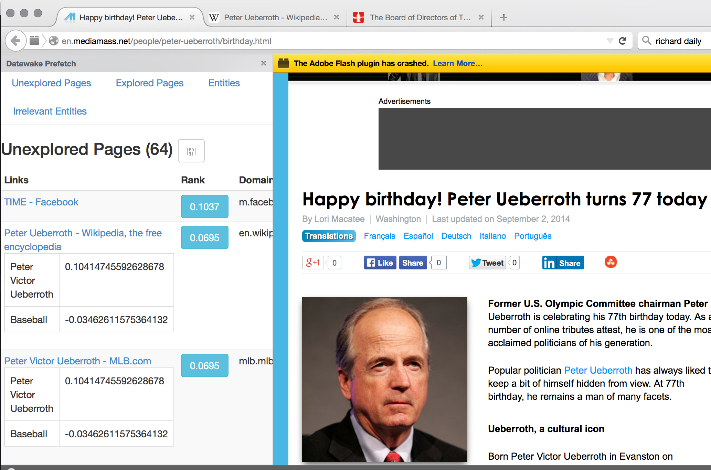

# DataWake Prefetch
Datawake prefetch allows a user to define entities and initiate a crawl of all websites
containing those entities.

First we are going to add an entity.  
  

Now we are going to exclude pages relating to baseball.  
  

Now we can look at pages and how they rank given the defined entities.  
  
