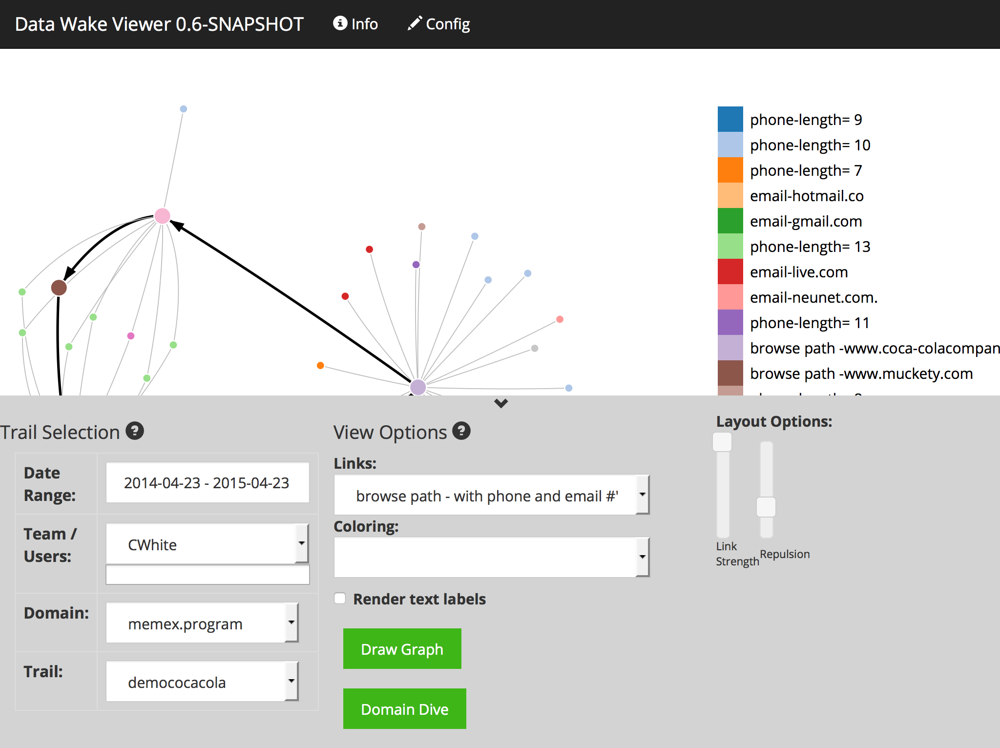
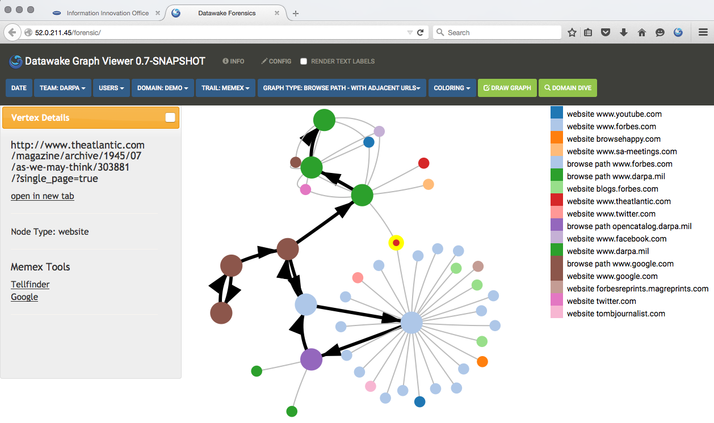

The Datawake project consists of various server and database
technologies along with a Firefox plugin that aggregate user browsing data via a plug-in using
domain-specific searches. This captured, or extracted, data is organized
into browse paths and elements of interest.  

  
Firefox Plugin showing entities extracted From the current page.  

  
Building the graph based on the pages that have been visited and the data within
those pages.  

The full graph of the data.  

# Applied Technology  
This work was funded by [DARPA's
Memex](http://www.darpa.mil/Our_Work/I2O/Programs/Memex.aspx) program
and leverages several technologies from [DARPA's Open
Catalog](http://www.darpa.mil/opencatalog/).
[MITIE: MIT Information Extraction](https://github.com/mitll/MITIE) - MIT-LL  
[Topic Clustering](https://github.com/mitll/topic-clustering) - MIT-LL  
[Tangelo](http://tangelo.kitware.com) - Kitware  
