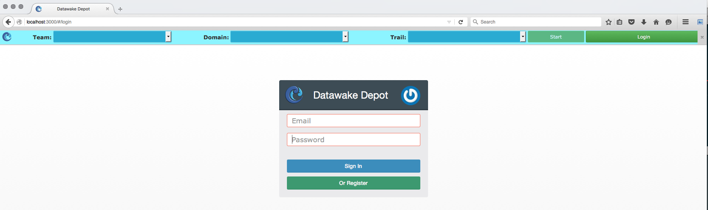
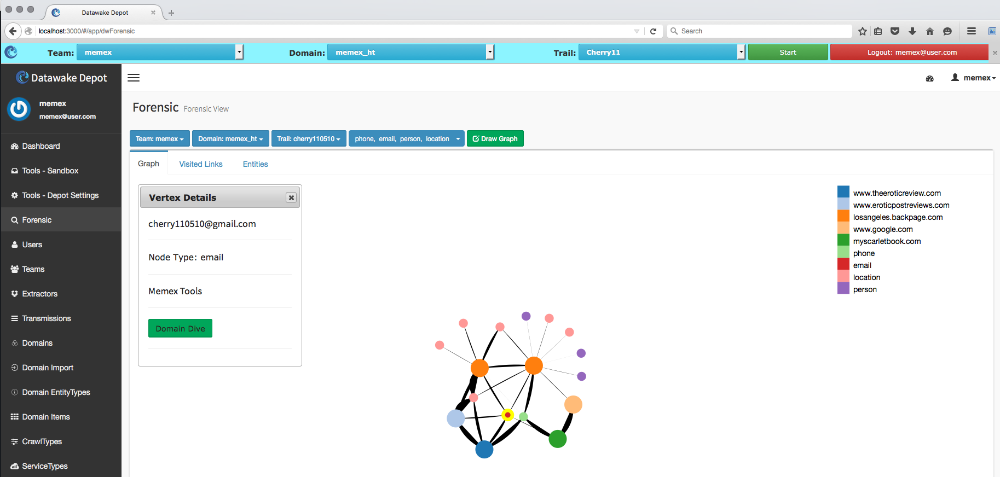
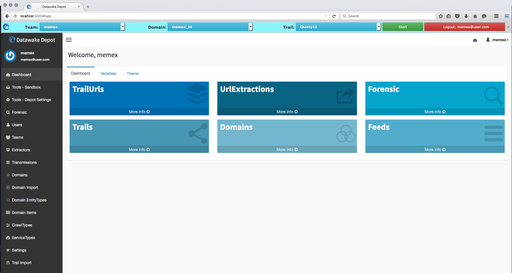

The Datawake project consists of various server and database
technologies along with a Firefox plugin that aggregate user browsing data via a
plug-in using domain-specific searches. This captured, or extracted, data is
organized into browse paths and elements of interest. The data can then be
analyzed by the user or a team and used to seed crawlers.

  
Firefox Plugin showing entities extracted From the current page.  

Graph of all extracted data from the pages visited by the user.

DataWake Depot Administrative Dashboard.

## Applied Technology  ##
This work was funded by [DARPA's
Memex](http://www.darpa.mil/Our_Work/I2O/Programs/Memex.aspx) program
and leverages several technologies from [DARPA's Open
Catalog](http://www.darpa.mil/opencatalog/).  DataWake is available on the [Memex Open Catalog](http://www.darpa.mil/opencatalog/MEMEX.html)  

# Datawake utilizes the following DARPA technology #
[MITIE: MIT Information Extraction](https://github.com/mitll/MITIE) - MIT-LL  
[Topic Clustering](https://github.com/mitll/topic-clustering) - MIT-LL  
[Tangelo](http://tangelo.kitware.com) - Kitware  

# Datawake Integrates with the following DARPA Memex Products  
[Memex Explorer](https://github.com/memex-explorer/memex-explorer)  
[Domain Discovery Tool](https://github.com/ViDA-NYU/domain_discovery_tool)  
[ImageSpace](https://github.com/memex-explorer/image_space)  
